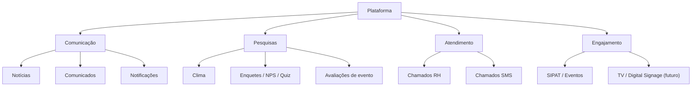
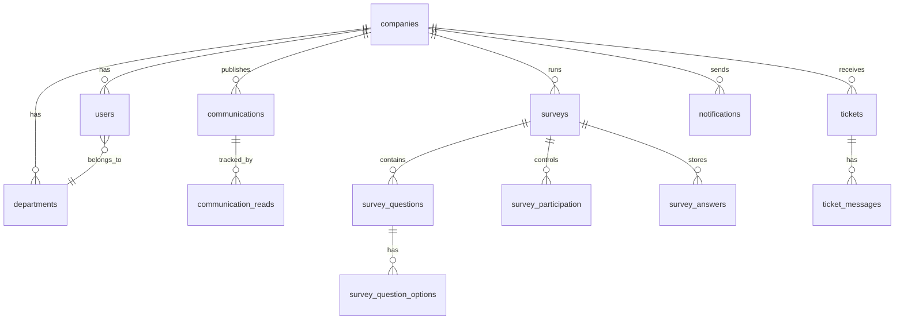
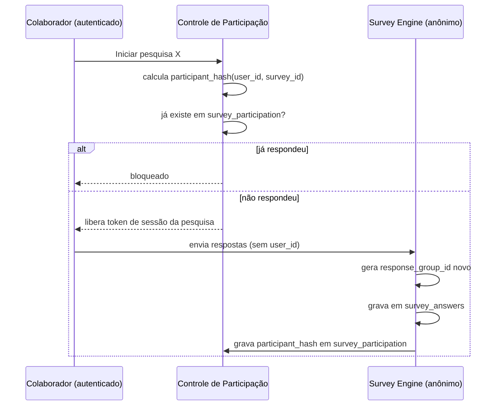

# Plataforma de Experiência do Colaborador — Especificação Técnica v1

> Documento de referência para implementação. Primeira empresa: Transbahia. Arquitetura pensada desde o início para virar produto multiempresa (SaaS), mas o MVP entrega valor real para uma única empresa primeiro.

---

## 1. Visão do produto

Plataforma corporativa de **comunicação interna, pesquisas e atendimento a colaboradores**, com experiência mobile-first, painéis administrativos por departamento, motor de pesquisas genérico e anônimo, sistema central de notificações, e arquitetura preparada — mas não construída prematuramente — para multiempresa (SaaS) e exibição em TV corporativa (digital signage).

**Primeiro entregável (Transbahia):** Notícias/Comunicados + Notificações + Pesquisas (com Clima Organizacional como primeiro caso de uso) + Chamados RH/SMS.



---

## 2. Princípios de arquitetura (decisões já tomadas)

Estes pontos foram decididos para evitar retrabalho e superengenharia:

1. **`company_id` em toda tabela desde o dia 1** — barato de fazer agora, caro de migrar depois. Isso **não** significa construir multi-tenant completo (RLS por tenant, billing, branding) já no MVP — isso fica para a Fase 6, quando existir uma segunda empresa de fato.
2. **Motor de pesquisas genérico, não "pesquisa de clima" hardcoded.** Clima é apenas um `type` dentro de `surveys`. O mesmo motor atende NPS, enquete, quiz, avaliação de evento, etc.
3. **Identidade separada de resposta.** O sistema nunca guarda o vínculo `usuário → resposta`. Controle de participação (evitar duplicidade) e armazenamento de respostas vivem em tabelas diferentes, sem chave estrangeira entre si (detalhes na seção 6).
4. **Comunicações unificadas.** "Notícia" e "Comunicado" são o mesmo tipo de entidade (`communications`) diferenciados por `type` e flags (`priority`, `require_read_confirmation`). Isso evita duplicar schema e simplifica o futuro cliente de TV, que só precisa consumir um feed.
5. **Monólito Next.js nas Fases 1–4, com camada de serviço isolada.** Não criamos um backend Node separado agora — Next.js (App Router) resolve frontend + API. Mas a lógica de negócio fica em uma camada de serviços desacoplada das rotas (`src/server/services/*`), não espalhada em componentes. Isso permite extrair um backend dedicado depois (Fase 5/6, quando o cliente de TV ou uma futura API pública justificarem o custo) sem reescrever regras de negócio. **Esta é uma decisão revisável** — reavaliar no início da Fase 5.
6. **MVP da Fase 1 é enxuto.** Um único painel administrativo (sem separar RH/SMS ainda) — a separação de painéis por departamento entra na Fase 3, junto com chamados.

---

## 3. Personas e permissões (RBAC)

| Papel | Escopo | Acesso |
|---|---|---|
| `employee` | Colaborador comum | Feed, notícias, comunicados, responder pesquisas, abrir chamados, notificações |
| `hr_admin` | RH da empresa | Tudo do employee + criar/gerenciar comunicações, pesquisas, chamados de RH, ver dashboards (com regra de anonimato) |
| `sms_admin` | Segurança/Medicina do Trabalho | Tudo do employee + chamados de SMS, comunicados de segurança, alertas com confirmação de leitura |
| `company_admin` | Administrador da empresa | Tudo dos admins acima + gestão de usuários, departamentos, cargos, configurações da empresa |
| `super_admin` | Dono da plataforma (Fase 6) | Gestão de empresas, planos, cobrança — não existe no MVP |

Regra transversal: **nenhum papel enxerga a associação entre um colaborador e uma resposta de pesquisa anônima**, nem mesmo `company_admin`. Isso é aplicado a nível de banco (RLS + separação de tabelas), não apenas na UI.

---

## 4. Modelo de dados (núcleo)

Banco: PostgreSQL via Supabase. Todas as tabelas abaixo (exceto `companies`) possuem `company_id` como FK obrigatória, com RLS restringindo cada query ao tenant do usuário autenticado.



### 4.1 Identidade e organização

```
companies        (id, name, slug, is_active, created_at)
departments      (id, company_id, name)
positions        (id, company_id, name)
users            (id, company_id, name, email, department_id, position_id,
                  role, status, auth_provider_id, created_at)
```

### 4.2 Comunicação (notícias + comunicados unificados)

```
communications           (id, company_id, type[news|announcement], title, body,
                           cover_image_url, category_id, author_id,
                           status[draft|scheduled|published|archived],
                           priority[normal|high], require_read_confirmation bool,
                           publish_at, expire_at, show_on_tv bool,
                           target_audience jsonb, created_at)
communication_categories (id, company_id, name)
communication_attachments(id, communication_id, url, type)
communication_reads      (id, communication_id, user_id, viewed_at, confirmed_at)
```

`target_audience` é um JSON flexível: `{ "departments": [...], "positions": [...], "branches": [...] }`, vazio = todos.

### 4.3 Pesquisas (Survey Engine genérico)

```
surveys                (id, company_id, title, description,
                         type[climate|safety|satisfaction|event|training|
                              leadership|benefits|communication|poll|
                              evaluation|quiz],
                         status[draft|scheduled|active|closed],
                         starts_at, ends_at,
                         is_anonymous bool, require_unique_response bool,
                         is_priority bool, show_progress bool,
                         min_responses_to_show_results int default 5,
                         target_audience jsonb, created_by, created_at)

survey_questions        (id, survey_id, order, text, required bool,
                         type[single_choice|multi_choice|scale_1_5|scale_0_10|
                              nps|text|yes_no|stars|matrix|category_rating],
                         config jsonb)

survey_question_options (id, question_id, label, order, value)
```

### 4.4 Anonimização — a parte crítica

Duas tabelas **sem FK entre si**:

```
survey_participation (id, survey_id, participant_hash, completed_at)

survey_answers       (id, survey_id, question_id, response_group_id,
                       answer jsonb, created_at)
```

- `participant_hash` = `HMAC-SHA256(user_id + survey_id, secret_da_empresa)`. Serve só para responder "esse usuário já participou?" — nunca é decodificável de volta para `user_id` sem o secret, e mesmo com o secret não aponta para nenhuma resposta.
- `response_group_id` = UUID aleatório gerado no momento do envio, **sem relação com `participant_hash` ou `user_id`**. Serve só para agrupar as respostas de um mesmo envio (para cruzar "quem respondeu X também respondeu Y" sem saber quem é "quem").



Regra de exibição de resultados: se um grupo (setor, cargo, filial) tiver menos de `min_responses_to_show_results` respostas, o dashboard **oculta o recorte** para impedir reidentificação por exclusão.

### 4.5 Atendimento (chamados)

```
ticket_categories  (id, company_id, department[hr|sms], name)
tickets            (id, company_id, number, requester_id, department[hr|sms],
                     category_id, priority, status, assigned_to,
                     title, description, created_at, closed_at)
ticket_messages    (id, ticket_id, author_id, body, created_at)
ticket_attachments (id, ticket_id, url)
```

### 4.6 Notificações e auditoria

```
notifications (id, company_id, user_id, type, title, body, link,
               read_at, created_at)
audit_logs    (id, company_id, actor_id, action, entity, entity_id,
               metadata jsonb, created_at)
```

---

## 5. Fluxos principais

### 5.1 Colaborador — pop-up de pesquisa prioritária

Regras configuráveis por pesquisa: mostrar uma vez por sessão, permitir "lembrar depois", tornar obrigatória, respeitar `starts_at`/`ends_at` e `target_audience`.

```
Login → verifica pesquisas ativas com is_priority=true e público compatível
      → já existe survey_participation para este user+survey? 
         não → exibe pop-up "Temos uma pesquisa para você"
         sim → não exibe
```

### 5.2 Admin — criador de pesquisas

Formulário no-code: título, descrição, tipo, período, público-alvo, flags de anonimato/obrigatoriedade/prioridade, e builder de perguntas com os 10 tipos definidos em `survey_questions.type`. Sem programação — tudo vira linhas em `surveys`/`survey_questions`/`survey_question_options`.

### 5.3 Chamados

Colaborador abre chamado (RH ou SMS) → categoria → responsável do time correspondente assume → histórico de mensagens/anexos → status (aberto/em andamento/resolvido/fechado) → notificação a cada mudança de status.

---

## 6. Sistema de notificações

Central única (`notifications`), com `type` distinguindo origem (nova pesquisa, novo comunicado, atualização de chamado, alerta de segurança). MVP: notificação in-app + badge. Push/e-mail entram como transporte adicional em fase posterior, sem mudar o modelo de dados.

---

## 7. Stack técnica

| Camada | Escolha | Racional |
|---|---|---|
| Frontend | Next.js (App Router) + TypeScript + Tailwind | PWA-ready, mobile-first, SSR bom para feed/notícias |
| Backend | API routes / server actions do próprio Next.js, com camada de serviço isolada (`src/server/services`) | Evita split prematuro; serviço isolado permite extrair backend dedicado na Fase 5/6 sem reescrever regra de negócio |
| Banco | Supabase (Postgres + Auth + Storage) | RLS nativo por `company_id`, Auth pronta, Storage para imagens/anexos |
| Autenticação | Supabase Auth + custom claim de `role` | RBAC simples via claim, validado em middleware |
| Hospedagem | Vercel (app) + Supabase Cloud (dados) | Deploy simples, bom para MVP |

Segurança obrigatória desde a Fase 1: RLS por `company_id` em toda tabela, rate limiting em endpoints de escrita (pesquisas/chamados), `audit_logs` para ações administrativas, secret de HMAC por empresa (rotável) para `participant_hash`.

---

## 8. Roadmap de fases

| Fase | Entrega | Critério de pronto |
|---|---|---|
| **1 — Comunicação (MVP)** | Auth + RBAC básico, schema multiempresa (sem super-admin), `communications` (notícias/comunicados unificados), notificações in-app, **um único painel admin**, responsivo mobile-first | Colaborador loga, vê feed, RH publica comunicado, colaborador recebe notificação |
| **2 — Pesquisas** | Survey Engine completo: criador, 10 tipos de pergunta, participação/anonimização, pop-up, dashboard com regra de mínimo de respostas, exportação | RH cria pesquisa de clima, colaboradores respondem anonimamente, RH vê resultados agregados sem reidentificação |
| **3 — Atendimento** | Chamados RH e SMS, **separação dos painéis admin por departamento**, categorias, histórico, anexos | Colaborador abre chamado, time responsável atende, status e notificações funcionam ponta a ponta |
| **4 — Engajamento** | Eventos/SIPAT, confirmação de leitura em comunicados, avaliações de evento | Programação de SIPAT publicada, inscrição, confirmação de leitura rastreada |
| **5 — Digital Signage** | Cliente de TV consumindo o feed de `communications`, playlists, programação automática | Tela de TV exibe comunicados/notícias marcados `show_on_tv` sem intervenção manual |
| **6 — SaaS** | `super_admin`, planos, billing, branding por empresa, domínio customizado, RLS multi-tenant completo | Segunda empresa opera isolada da Transbahia na mesma instância |

---

## 9. Do documento ao código

Este documento **não** vira um único prompt gigante para o Cloud Code. Cada fase vira um prompt de implementação próprio, construído a partir:
1. Deste documento (contrato estável);
2. Do estado real do repositório naquele momento (não do que "deveria" existir).

Ordem sugerida de implementação dentro da Fase 1: schema (migrations) → auth/RBAC → CRUD de `communications` → feed do colaborador → painel admin → notificações. Cada etapa validada antes de avançar para a próxima.
